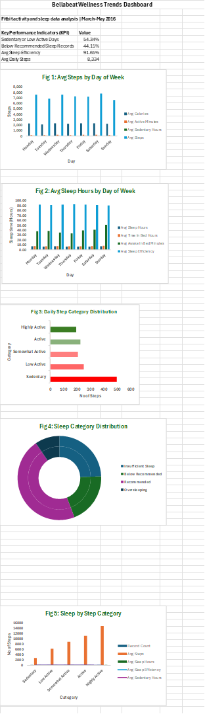

# Bellabeat Wellness Analysis

## Project Overview

This project is an Excel-based data analytics case study completed as part of the Google Data Analytics Capstone. The analysis explores Fitbit smart device data to identify wellness behavior trends and generate marketing recommendations for Bellabeat, a wellness technology company focused on health tracking products for women.

The project uses daily activity and sleep data to understand user behavior related to movement, sedentary time, sleep duration, and sleep efficiency. The final deliverables include a cleaned Excel workbook, PivotTable analysis, dashboard visualizations, key findings, and business recommendations.

## Business Task

Bellabeat wants to better understand how consumers use smart devices in their daily lives. The goal of this analysis is to identify trends in Fitbit activity and sleep data and use those insights to make high-level marketing recommendations for Bellabeat.

The guiding business question is:

> How can trends in smart device usage inform Bellabeat's marketing strategy?

## Tools Used

- Microsoft Excel
- Excel Tables
- Excel formulas
- PivotTables
- PivotCharts
- Dashboard design
- Data cleaning and documentation

## Dataset

The analysis uses the publicly available FitBit Fitness Tracker Data from Kaggle.

Dataset source: FitBit Fitness Tracker Data made available through Mobius on Kaggle.

The dataset contains personal fitness tracker data from Fitbit users, including daily activity, steps, sedentary time, calories, and sleep records.

For this project, the primary datasets used were:

- Daily activity data
- Sleep data

## Data Preparation and Cleaning

The data was prepared and cleaned in Excel before analysis. Major processing steps included:

- Imported daily activity and sleep datasets into Excel.
- Preserved raw data sheets for transparency.
- Created working copies for cleaning and transformation.
- Combined daily activity records from two date ranges.
- Removed duplicate activity records based on user ID and activity date.
- Removed exact duplicate sleep records.
- Added derived columns for weekday, month, active minutes, sedentary hours, sleep hours, sleep efficiency, and behavioral categories.
- Created a merged activity-sleep dataset using user ID and date.
- Documented cleaning steps in a cleaning log.
- Documented calculated fields in a data dictionary.

## Analysis Approach

The analysis followed the six phases of the data analysis process:

1. Ask
2. Prepare
3. Process
4. Analyze
5. Share
6. Act

PivotTables and dashboard visuals were used to summarize activity and sleep trends, including:

- Distribution of daily step categories
- Distribution of sleep categories
- Average sleep metrics by day of week
- Average sleep metrics by daily step category
- Activity and sleep relationship patterns

## Dashboard Preview

A PDF version of the dashboard is also available in the `dashboard` folder.

## Key Findings

### 1. More than half of tracked activity days showed low movement

Out of 1,373 tracked activity records, 54.34% were classified as either Sedentary or Low Active.

| Step Category | Count of Days | Percentage |
|---|---:|---:|
| Sedentary | 496 | 36.13% |
| Low Active | 250 | 18.21% |
| Somewhat Active | 207 | 15.08% |
| Active | 225 | 16.39% |
| Highly Active | 195 | 14.20% |

This suggests that many users may benefit from gentle movement reminders, beginner-friendly goals, and personalized activity encouragement.

### 2. Nearly half of sleep records were below the recommended range

Out of 410 sleep records, 44.15% were below the recommended sleep range.

| Sleep Category | Count of Sleep Records | Percentage |
|---|---:|---:|
| Insufficient Sleep | 100 | 24.39% |
| Below Recommended | 81 | 19.76% |
| Recommended | 190 | 46.34% |
| Oversleeping | 39 | 9.51% |

This indicates an opportunity for Bellabeat to support users with bedtime reminders, wind-down routines, and personalized sleep education.

### 3. Sleep patterns varied by day of week

The average sleep duration across all sleep records was 6.99 hours. Sunday had the highest average sleep duration at 7.55 hours, while Thursday had one of the lowest averages at 6.69 hours.

| Day of Week | Avg Sleep Hours | Avg Time in Bed Hours | Avg Awake in Bed Minutes | Avg Sleep Efficiency |
|---|---:|---:|---:|---:|
| Monday | 6.99 | 7.62 | 37.8 | 91.97% |
| Tuesday | 6.74 | 7.39 | 38.8 | 91.10% |
| Wednesday | 7.25 | 7.83 | 35.3 | 92.13% |
| Thursday | 6.69 | 7.25 | 33.6 | 92.27% |
| Friday | 6.76 | 7.42 | 39.6 | 92.01% |
| Saturday | 6.99 | 7.66 | 40.8 | 91.50% |
| Sunday | 7.55 | 8.39 | 50.8 | 90.51% |

Although Sunday had the longest average sleep duration, it also had the lowest average sleep efficiency.

### 4. Higher step categories did not automatically align with better sleep outcomes

The merged activity-sleep data showed that Highly Active days had the highest average steps but the lowest average sleep duration and sleep efficiency.

| Daily Step Category | Record Count | Avg Steps | Avg Sleep Hours | Avg Sleep Efficiency | Avg Sedentary Hours |
|---|---:|---:|---:|---:|---:|
| Sedentary | 103 | 2,832 | 7.51 | 92.64% | 11.51 |
| Low Active | 72 | 6,223 | 6.99 | 92.02% | 12.12 |
| Somewhat Active | 74 | 8,875 | 7.10 | 93.29% | 11.63 |
| Active | 98 | 11,076 | 6.74 | 90.29% | 11.69 |
| Highly Active | 63 | 14,843 | 6.37 | 89.78% | 11.33 |

This suggests that Bellabeat should position wellness as a balance of activity, rest, recovery, and sleep quality rather than focusing only on step counts.

## Recommendations

### 1. Promote balanced wellness, not only step tracking

Bellabeat should position its products as wellness companions that support movement, sleep, recovery, and stress management together. The analysis suggests that higher activity levels do not automatically correspond with better sleep outcomes.

### 2. Personalize movement nudges for sedentary and low-active users

Since 54.34% of tracked activity days were Sedentary or Low Active, Bellabeat can use app-based reminders, short walking prompts, beginner-friendly challenges, and habit-building messages to encourage sustainable movement.

### 3. Support sleep consistency and recovery

Because 44.15% of sleep records were below the recommended range, Bellabeat can promote bedtime reminders, wind-down content, sleep routine tracking, and recovery-focused insights, especially for active users who may not be getting enough sleep.

## Limitations

This analysis has several limitations:

- The sample size is relatively small.
- The data represents Fitbit users, not Bellabeat users.
- Demographic information such as age, gender, location, and health status was not available.
- The dataset covers a limited time period.
- The analysis identifies patterns and associations, but it does not prove causation.
- Some users have activity data without corresponding sleep records.

These limitations should be considered before generalizing the findings to Bellabeat's full target market.

## Files in This Repository

| File/Folder | Description |
|---|---|
| `Bellabeat_Capstone_Analysis.xlsx` | Full Excel workbook containing raw data, cleaned data, PivotTables, dashboard, and recommendations |
| `dashboard/bellabeat_dashboard.png` | Dashboard image preview |
| `dashboard/bellabeat_dashboard.pdf` | PDF export of the dashboard |
| `README.md` | Project documentation and summary |

## Project Status

Completed.

## Author

Ayodele Oyadeyi

PhD biomedical scientist and health data analyst focused on applying analytics to health, biomedical, clinical, and life science data.
